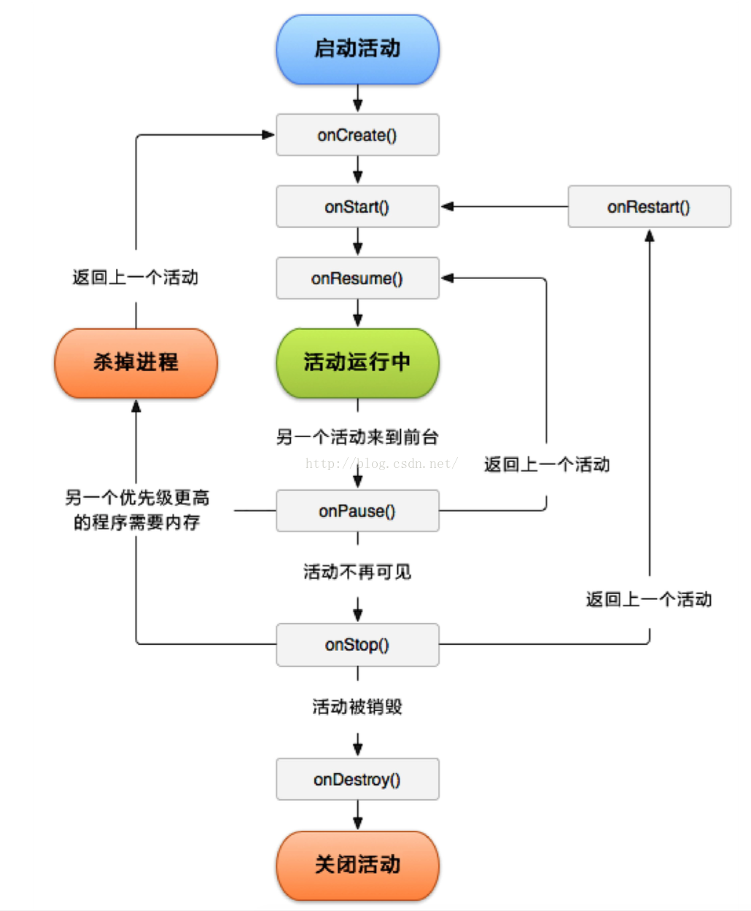

###安卓分享

####开发环境、工具、语言
* 开发工具包：jdk(包含:jre 基础类库 工具集) adk ndk
* IDE：AndroidStudio Eclipse VS
* 语言：kotlin java c/c++

####平台框架
∑

####四大组件
* 1.Activity 活动

一个Activity是一个用户可以触摸使用的最简单的一个单位，几乎所有的activity们都和用户交互，所以Activity类会在setContentView方法内放置一个UI布局以创建一个窗口。

显性启动一个activity startActivity(new Intent(Context packageContext, Class<?> cls))
还有隐性启动

Activity栈
Android 是通过一种 Activity 栈的方式来管理 Activity，处于前台的 Activity 总是在栈的顶端，当前台的 Activity 因为异常或其它原因被销毁时，处于栈第二层的 Activity 将被激活，上浮到栈顶。当新的 Activity 启动入栈时，原 Activity 会被压入到栈的第二层。一个 Activity 在栈中的位置变化反映了它在不同状态间的转换，一个 Activity 的实例越是处在栈的底层，它被系统回收的可能性越大。

Activity生命周期


Activity启动模式
Standard
这个模式是默认的启动模式，即标准模式，每次启动一个Activity都会重新创建一个实例，不管这个实例存不存在，这种模式下，谁启动了该模式的Activity，该Activity就属于启动它的Activity的任务栈中。
[AB] + B = [ABB]

singleTop
这个模式下，如果新的activity已经位于栈顶，那么这个Activity不会被重写创建，同时它的onNewIntent方法会被调用，通过此方法的参数我们可以去除当前请求的信息。如果栈顶不存在该Activity的实例，则情况与standard模式相同。
[AB] + B = [AB]
[ABC] + B = [ABCB]

singleTask
在这个模式下，如果栈中存在这个Activity的实例就会复用这个Activity，不管它是否位于栈顶，复用时，会将它上面的Activity全部出栈，并且会回调该实例的onNewIntent方法。
[ABC] + B = [AB]

singleInstance
该模式具备singleTask模式的所有特性外，与它的区别就是，这种模式下的Activity会单独占用一个Task栈，具有全局唯一性，即整个系统中就这么一个实例，由于栈内复用的特性，后续的请求均不会创建新的Activity实例，除非这个特殊的任务栈被销毁了。以singleInstance模式启动的Activity在整个系统中是单例的，如果在启动这样的Activiyt时，已经存在了一个实例，那么会把它所在的任务调度到前台，重用这个实例。 
[B][AC] + B = [AC][B]

* 2.Service 后台任务

Service可以在后台执行长时间的操作，Service并不与用户产生UI交互。其他的应用组件可以启动Service，即便用户切换了其他应用，启动的Service仍可在后台运行。一个组件可以与Service绑定并与之交互，甚至是跨进程通信（IPC）。例如，一个Service可以在后台执行网络请求、播放音乐、执行文件读写操作。

Services有两种启动形式：
Started：其他组件调用startService()方法启动一个Service。一旦启动，Service将一直运行在后台。通常，一个被start的Service会在后台执行单独的操作，也并不给启动它的组件返回结果。比如说，一个start的Service执行在后台下载或上传一个文件的操作，完成之后，Service应自己停止。

Bound：其他组件调用bindService()方法绑定一个Service。通过绑定方式启动的Service是一个client-server结构，该Service可以与绑定它的组件进行交互。一个bound service仅在有组件与其绑定时才会运行，多个组件可与一个service绑定，service不再与任何组件绑定时，该service会被destroy。

* 3.Content Proveder 内容提供者

ContentProvider为存储和读取数据提供了统一的接口,可以实现在应用程序之间共享数据，实际应用中实现一个自定义的ContentProvider的需求是比较少，但是用到ContentProvider地方还是有的,android内置的许多数据都是使用ContentProvider形式，供开发者调用的(如视频，音频，图片，通讯录等)。
每一个ContentProvider都拥有一个公共的Uri，这个Uri用于表示这个ContentProvider提供的数据

```
  获取通讯录
  ContentResolver cr = getContentResolver();
  //定义一个接收联系人姓名和电话号码的集合
	datalistView = new ArrayList<>();
  Uri uri=Uri.parse("content://com.android.contacts/raw_contacts");
  Cursor cursor= cr.query(uri,null,null,null,null);
  while(cursor.moveToNext()){
    int id=cursor.getInt(cursor.getColumnIndex("_id"));
    Uri uriData=Uri.parse("content://com.android.contacts/raw_contacts/"+id+"/data");
    Cursor contactData= cr.query(uriData,null,null,null,null);
    //用来装姓名
    String aa="";
    //用来装号码
    String bb="";
    while(contactData.moveToNext()){
      String type=contactData.getString(contactData.getColumnIndex("mimetype"));
      //如果获取的是vnd.android.cursor.item/phone_v2则是号码
      if(type.equals("vnd.android.cursor.item/phone_v2")){
        bb=contactData.getString(contactData.getColumnIndex("data1"));
        //如果获取的是vnd.android.cursor.item/name则是姓名
      }else if(type.equals("vnd.android.cursor.item/name")) {
        aa=contactData.getString(contactData.getColumnIndex("data1"));
      }
    }
    //将用户名和号码放入Map集合中
    Map<String,Object> map=new HashMap<>();
    map.put("images",aa);
    map.put("titles",bb);
    datalistView.add(map);
  }
```


* 4.BroadcastReceiver

```
	发送广播
	Intent intent = new Intent();  
    intent.setAction(Intent.ACTION_BATTERY_CHANGED)
    intent.putExtra(..., ...);   
    sendBroadcast(intent);  

	接收广播
	IntentFilter intentFilter = new IntentFilter(Intent.ACTION_BATTERY_CHANGED);
	c2dx.registerReceiver(new BatteryReceiver(), intentFilter);

	public class BatteryReceiver extends BroadcastReceiver {
    private static String TAG = "BatteryReceiver";
    @Override
    public void onReceive(Context context, Intent intent) {
        //判断它是否是为电量变化的Broadcast Action
        if(Intent.ACTION_BATTERY_CHANGED.equals(intent.getAction())){
            //获取当前电量
            float level = intent.getIntExtra("level", 0);
            final float m_battery = level / 100;
            if (AndroidBridge.GET_BATTERY_BACK > 0)
            {
                AndroidBridge.c2dx.runOnGLThread(new Runnable() {
                    public void run() {
                        Cocos2dxLuaJavaBridge.callLuaFunctionWithString(AndroidBridge.GET_BATTERY_BACK, String.valueOf(m_battery));
                    }
                });
            }
            return;
        }
    }
}
动态注册的广播会受Activity的生命周期的影响， 当Activity销毁的时候，广播就失效了。
静态注册的广播，即使Activity销毁了，仍然可以收到广播。即使杀死进程，也有可以收到广播（不一定）

```
####项目结构
```
AndroidManifest.xml
java
assets
libs
res

build.gradle build脚本 
		minSdkVersion 		应用程序运行所需的最小API版本
		compileSdkVersion   用哪个 Android SDK 版本编译你的应用，只是在编译的时候使用
		targetSdkVersion    Android提供向前兼容的主要依据，当设备系统高于你所编译的安卓targetSdkVersion时，会开启兼容模式以保障程序正常运行
```

####原生安卓与Lua的交互
* android 利用Jni进行过度 Java <---（JNI）--> C++ <--- ---> Lua

Lua调用android的过程

```
deviceEx.lua   line45
	-- 获得安卓的设备型号
	local function getAndroidDeviceModel()
		local javaClassName = "air/com/dartou/android/ChinesePokerMobile/util/AndroidBridge" 
	    local javaMethodName = "getDeviceModel"
	    local javaMethodSig = "()Ljava/lang/String;"
	    local ok, name = luaj.callStaticMethod(javaClassName, javaMethodName, nil, javaMethodSig)
	    ...
	end

luaj.lua           line4
	local callJavaStaticMethod = LuaJavaBridge.callStaticMethod
	callJavaStaticMethod(className, methodName, args, sig)

CCLuaJavaBridge.cpp line257
	在lua全局栈中载入 LuaJavaBridge.callStaticMethod 指向调用 LuaJavaBridge::callJavaStaticMethod
	void LuaJavaBridge::luaopen_luaj(lua_State *L)
	{
		s_luaState = L;
	    lua_newtable(L);
	    lua_pushstring(L, "callStaticMethod");
	    lua_pushcfunction(L, LuaJavaBridge::callJavaStaticMethod);
	    lua_rawset(L, -3);
	    lua_setglobal(L, "LuaJavaBridge");
	}

	LuaJavaBridge::callJavaStaticMethod
	{
		实例化一个CallInfo对象，确认返回值，找到当前DVM实例中的java类和成员方法
		CallInfo call(className, methodName, methodSig);
		根据返回值的不用调用java方法
		bool success = args ? call.executeWithArgs(args) : call.execute();
	}

[air/com/dartou/android/ChinesePokerMobile/util]
AndroidBridge.java
	public static String getDeviceModel() {
			return Build.MODEL;
		}
```

关于java方法的sign
```
	类型           相应的签名  
	boolean        Z  
	byte           B  
	char           C  
	short          S  
	int            I  
	long           J  
	float          F  
	double         D  
	void           V  
	object         L用/分隔包的完整类名：   Ljava/lang/String; 
	Array          [签名          [I      [Ljava/lang/Object; 
```

android 调用lua的 过程
```
Cocos2dxLuaJavaBridge.java
	public class Cocos2dxLuaJavaBridge
	{
	    public static native int callLuaFunctionWithString(int luaFunctionId, String value);
	    public static native int callLuaGlobalFunctionWithString(String luaFunctionName, String value);
	    public static native int retainLuaFunction(int luaFunctionId);
	    public static native int releaseLuaFunction(int luaFunctionId);
	}

Java_org_cocos2dx_lib_Cocos2dxLuaJavaBridge.cpp

	调用lua方法带一个string的参数
	JNIEXPORT jint JNICALL Java_org_cocos2dx_lib_Cocos2dxLuaJavaBridge_callLuaFunctionWithString
	  (JNIEnv *env, jclass cls, jint functionId, jstring value)
	{
	    std::string strValue = cocos2d::StringUtils::getStringUTFCharsJNI(env, value);
	    int ret = LuaJavaBridge::callLuaFunctionById(functionId, strValue.c_str());
	    return ret;
	}

	调用全局lua方法带一个string的参数
	JNIEXPORT jint JNICALL Java_org_cocos2dx_lib_Cocos2dxLuaJavaBridge_callLuaGlobalFunctionWithString
	  (JNIEnv *env, jclass cls, jstring luaFunctionName, jstring value)
	{
	    std::string functionNameStr = cocos2d::StringUtils::getStringUTFCharsJNI(env, luaFunctionName);
	    std::string valueStr = cocos2d::StringUtils::getStringUTFCharsJNI(env, value);
	    
	    int ret = LuaJavaBridge::callLuaGlobalFunction(functionNameStr.c_str(), valueStr.c_str());
	    return ret;
	}

	lua方法引用计数+1
	JNIEXPORT jint JNICALL Java_org_cocos2dx_lib_Cocos2dxLuaJavaBridge_retainLuaFunction
	  (JNIEnv *env, jclass cls, jint luaFunctionId)
	{
	    return LuaJavaBridge::retainLuaFunctionById(luaFunctionId);
	}

	lua方法引用计数-1
	JNIEXPORT jint JNICALL Java_org_cocos2dx_lib_Cocos2dxLuaJavaBridge_releaseLuaFunction
	  (JNIEnv *env, jclass cls, jint luaFunctionId)
	{
	    return LuaJavaBridge::releaseLuaFunctionById(luaFunctionId);
	}

```

总结：需要关注的方法
luaj.callStaticMethod(java类, java类方法, 参数, 方法SIGN)
Cocos2dxLuaJavaBridge.callLuaFunctionWithString(lua方法id, string参数)
Cocos2dxLuaJavaBridge.callLuaGlobalFunctionWithString(lua全局方法名, string参数)
Cocos2dxLuaJavaBridge.releaseLuaFunction(lua方法id)


